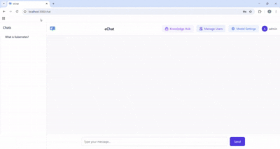

# eChat - AI Chat Application

A modern chat application with AI capabilities using DeepSeek R1, Ollama, and RLHF (Reinforcement Learning from Human Feedback).



## System Requirements

### Minimum Configuration
- **CPU**: 8+ cores (Intel i7-12700 or equivalent)
- **RAM**: 16GB+ 
- **GPU**: NVIDIA GPU with 8GB+ VRAM (RTX 3050 or better)
- **Storage**: 50GB+ SSD space
- **Network**: Stable internet connection for model downloads
- **OS**: Linux (Ubuntu 20.04+)


## Prerequisites

### Required Software
1. **Docker** (version 20.10+ recommended)
2. **Docker Compose** (version 2.0+ recommended)

### For GPU Acceleration (Optional but Recommended)
3. **NVIDIA GPU** with CUDA support
4. **NVIDIA Container Toolkit** for Docker GPU access
5. **CUDA** version 12.0+ (automatically handled by containers)

### For Development (Optional)
6. **Python** 3.10+ (for backend development)
7. **Node.js** 18+ and npm (for frontend development)
8. **Git** for version control

## Installation Guide

### 1. Install Docker and Docker Compose
```bash
# Ubuntu/Debian
sudo apt update
sudo apt install docker.io docker-compose-plugin

# Enable Docker service
sudo systemctl enable --now docker
sudo usermod -aG docker $USER
```

### 2. Install NVIDIA Container Toolkit (for GPU support)
```bash
# Add NVIDIA package repository
distribution=$(. /etc/os-release;echo $ID$VERSION_ID) \
   && curl -s -L https://nvidia.github.io/nvidia-docker/gpgkey | sudo apt-key add - \
   && curl -s -L https://nvidia.github.io/nvidia-docker/$distribution/nvidia-docker.list | sudo tee /etc/apt/sources.list.d/nvidia-docker.list

# Install nvidia-container-toolkit
sudo apt update
sudo apt install -y nvidia-container-toolkit

# Restart Docker service
sudo systemctl restart docker
```

### 3. Verify GPU Setup (Optional)
```bash
# Test NVIDIA runtime
docker run --rm --gpus all nvidia/cuda:12.0-runtime-ubuntu20.04 nvidia-smi
```

## Quick Start

1. Clone the repository:
```bash
git clone https://github.com/nandagopalan392/echat.git
cd echat
```

2. Launch the application:
```bash
# Start all services
docker compose up -d

# First-time setup: Wait for model downloads (5-10 minutes)
# Monitor progress with:
docker compose logs -f ollama

# Application will be ready when you see "Ollama server is running"
```

3. **First-time model setup**: The system will automatically download the DeepSeek R1 model (~7GB). This may take several minutes depending on your internet connection.

4. **Access the application**: Open http://localhost:3000 in your browser.

## Accessing Services

All services are configured to run on localhost:

- **Frontend**: http://localhost:3000 (Main chat interface)
- **Backend API**: http://localhost:8000 (REST API)
- **Ollama**: http://localhost:11434 (AI model server)
- **MinIO API**: http://localhost:9100 (File storage API)
- **MinIO Console**: http://localhost:9101 (File management UI)

### Memory Usage
- **Total System**: ~4-6GB RAM during operation
- **GPU VRAM**: ~4-6GB for DeepSeek R1 model
- **Disk Space**: ~15GB after initial setup

## Features

- 🤖 **Ollama Integration** - Supports all the model in ollama
- 🧠 **RLHF Support** - Choose between different response styles
- 📄 **Document Processing** - Upload and chat with PDFs, DOCX, etc.
- 👥 **Multi-user Support** - User management and session tracking
- 📊 **Real-time Monitoring** - Performance metrics and logging
- 🔒 **Security** - JWT authentication and secure file handling

## Development

### Frontend Development

```bash
cd frontend
npm install
npm start
```

### Backend Development

```bash
cd backend
pip install -r requirements.txt
python main.py
```


## Troubleshooting

### Common Issues

1. **Services fail to start**:
```bash
# Check logs for specific errors
docker compose logs -f

# Check system resources
docker system df
free -h
```

2. **Slow AI responses**:
```bash
# Verify GPU is being used
docker compose exec ollama nvidia-smi

# Check if models are properly loaded
docker compose logs ollama | grep -i "model"
```

3. **Out of memory errors**:
```bash
# Check container memory usage
docker stats

# Reduce memory usage by stopping other applications
# Or increase Docker memory limits in Docker Desktop
```

4. **Model download issues**:
```bash
# Manually pull the model
docker compose exec ollama ollama pull deepseek-r1:latest

# Check available disk space
df -h
```

5. **Complete reset** (if all else fails):
```bash
# Stop and remove everything
docker compose down -v

# Remove downloaded models and data
docker volume prune

# Clean Docker system
docker system prune -a

# Start fresh
docker compose up -d
```


## Contribution

We welcome contributions to eChat! Please follow these steps to contribute:

### How to Contribute

1. **Fork the repository**
   ```bash
   # Click "Fork" on GitHub, then clone your fork
   git clone https://github.com/your-username/echat.git
   cd echat
   ```

2. **Set up the development environment**
   ```bash
   # Add the original repository as upstream
   git remote add upstream https://github.com/nandagopalan392/echat.git
   
   # Create a virtual environment for backend development
   cd backend
   python -m venv venv
   source venv/bin/activate  # On Windows: venv\Scripts\activate
   pip install -r requirements.txt
   
   # Install frontend dependencies
   cd ../frontend
   npm install
   ```

3. **Create a feature branch**
   ```bash
   git checkout -b feature/your-feature-name
   ```

4. **Make your changes**
   - Follow the existing code style and conventions
   - Add tests for new functionality
   - Update documentation as needed

5. **Test your changes**
   ```bash
   # Start the development environment
   docker compose up -d
   
   # Test backend changes
   cd backend
   python -m pytest  # If tests are available
   
   # Test frontend changes
   cd frontend
   npm test  # If tests are available
   ```

6. **Commit your changes**
   ```bash
   git add .
   git commit -m "feat: add your feature description"
   ```

7. **Push to your fork and create a Pull Request**
   ```bash
   git push origin feature/your-feature-name
   ```
   Then go to GitHub and create a Pull Request from your fork.

### Contribution Guidelines

- **Code Style**: Follow PEP 8 for Python code and ESLint rules for JavaScript
- **Commit Messages**: Use conventional commit format (feat:, fix:, docs:, etc.)
- **Documentation**: Update README.md and inline comments for any new features
- **Testing**: Add appropriate tests for new functionality
- **Security**: Never commit sensitive information like API keys or passwords

### Areas for Contribution

- 🐛 Bug fixes and improvements
- ✨ New AI model integrations
- 🎨 UI/UX improvements
- 📚 Documentation enhancements
- 🧪 Test coverage improvements
- 🔧 DevOps and deployment optimizations

### Getting Help

- Open an issue for bug reports or feature requests
- Join discussions in existing issues
- Contact maintainers for questions about contributing

By contributing, you agree to the terms of the Contributor License Agreement.